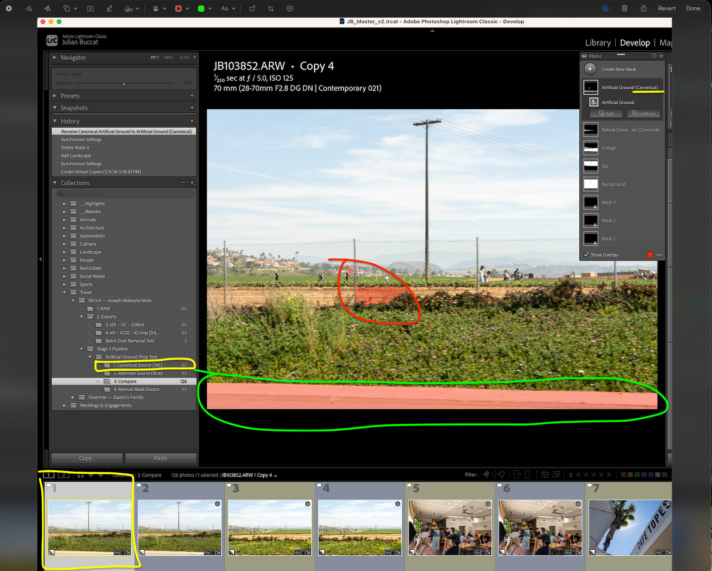
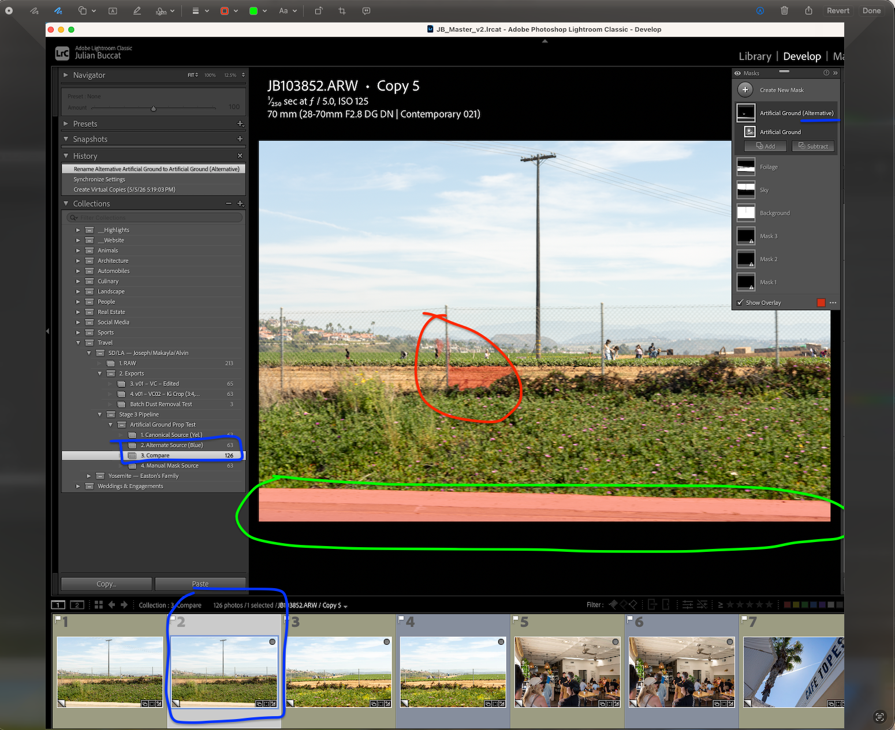
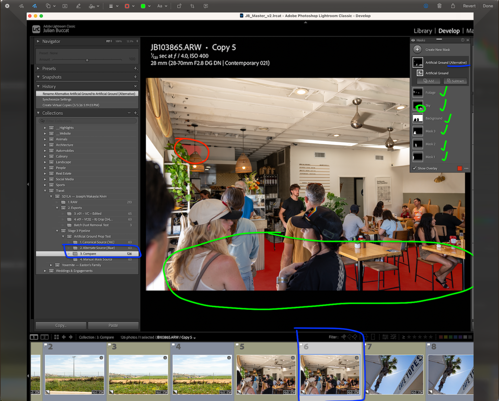
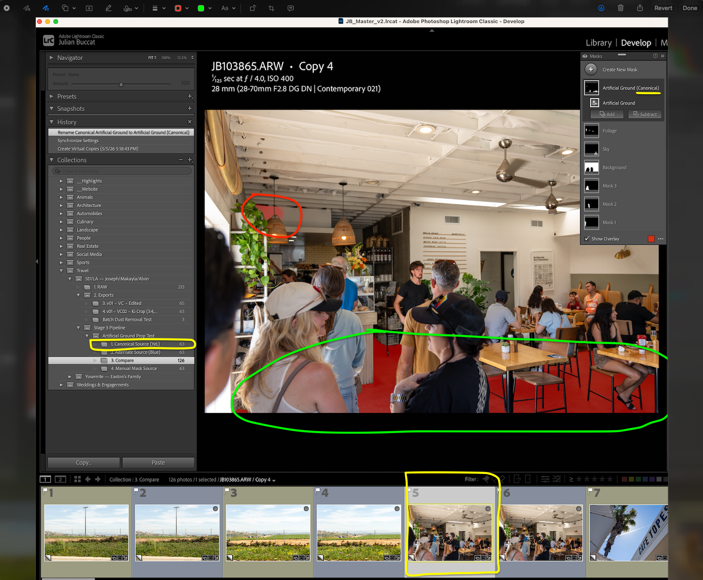

# Production Workflow System Design & Implementation: AI Mask Definition Propagation

Part of the **Creative Workflow Batch Transformation Pipeline** umbrella project.

<br>

## Executive Summary

This stage evaluates whether AI-generated semantic masks can be treated
as reusable batch artifacts rather than one-off, image-specific edits, similarly to Stage 2.
The workflow defines mask logic once on a [canonical image](../../docs/terminology.md#canonical-image),
then applies that logic across the full [gallery](../../docs/terminology.md#gallery) to test whether Lightroom
recomputes the masks per image reliably enough for production-scale use.
The value is reduced repetitive masking effort with a clear review
boundary when semantic detection fails or degrades.

Within the larger pipeline, Stage 3 extends the deterministic workflow
pattern to probabilistic AI outputs. AI masks are not treated as
automatically correct; they are treated as candidate semantic operations
that must be qualified, propagated within defined boundaries, and
reviewed by a human operator.

<br>

## Problem

Manual semantic masking is expensive at [gallery](../../docs/terminology.md#gallery) scale. When similar
adjustments are needed across hundreds of photos, manually brushing each
semantic region image by image becomes a throughput bottleneck. Without
a reusable mask-definition workflow, repeated local edits remain tied to
per-image manual execution.

Unlike Stage 2 normalization, which controls variance in the image data
itself, Stage 3 controls uncertainty introduced by AI model behavior:
semantic regions may be detected cleanly, omitted safely, partially
misbound, or produced with boundaries that still require operator
judgment.
The systems challenge is to propagate AI-generated mask definitions
safely across the heterogeneous input data (gallery) without copying brittle pixel
selections or introducing silent failures that would require extensive
rework.

<br>

## Solution Overview

The workflow selects a canonical image containing many relevant
semantic categories, defines the mask logic once on that image, and then
batch-pastes those definitions across the [gallery](../../docs/terminology.md#gallery). Lightroom recomputes
the masks per target image using dynamic semantic segmentation rather
than copying static mask pixels. This implementation scales that feature
from single-image editing into a batch workflow, then evaluates the
mechanism qualitatively by examining mask quality, omission behavior,
and operational usefulness relative to the alternative — manual masking.

<br>

## Key Constraints

- target images vary in subjects, scene composition, and detectable semantic categories
- Lightroom's internal masking implementation logic is not directly observable
- some propagated masks may be omitted rather than generated on every image
- AI segmentation quality can degrade or improve in non-obvious,
  image-specific ways
- automation must remain logistically compatible with later manual review and correction

<br>

## Technical Design & Implementation

This stage defines mask logic once, then applies it across the
[gallery](../../docs/terminology.md#gallery) as a batch workflow.
Lightroom recomputes semantic masks per image for
people, sky, vegetation, and other detectable regions rather than
copying static pixels. That makes propagation scalable, but it also
means outcomes are only partially deterministic: a mask may bind
correctly, bind weakly, omit a missing region safely, or produce a
plausible result that still requires editorial judgment. For that
reason, qualification and human review remain required parts of the
design rather than optional cleanup after a one-time batch command.

<br>

> [!IMPORTANT]
> **Governing Principle:** Qualify first, propagate second.

<br>

### Experiment Objectives

1. **Confirm propagation behavior:** verify that Lightroom reuses mask definitions as procedural instructions and recomputes the target regions per image, rather than copying fixed pixel selections.
2. **Review operational mask quality:** inspect the generated masks to confirm that expected subjects and regions were detected, contained, and usable for downstream editing.

<br>

### Evaluation Criteria

- **Detection completeness:** whether expected semantic regions such as people, sky, and foliage are generated when present.
- **Omission behavior:** whether absent semantic regions are safely skipped rather than producing incorrect masks.
- **Semantic binding (classification):** whether each generated mask binds to the intended semantic class or region rather than a visually adjacent or incorrect class.
- **Boundary containment (mask edge quality):** whether generated mask boundaries stay contained within the intended subject regions rather than bleeding into adjacent areas.

The evaluation reduces to four operator checks:

```text
Expected region present   → mask generated?
Expected region absent    → mask skipped?
Generated mask            → correct semantic class?
Generated mask            → contained boundary?
```

Together, these criteria determine whether the propagated masks are
usable for downstream edits with bounded human review.

> **In-depth note:** Omission is usually the correct outcome, not a
> negative one. When a target image lacks the semantic category,
> Lightroom may still show a mask thumbnail from the propagated
> definition while leaving the mask itself undrawn, which creates no
> meaningful downside in practice and preserves fault tolerance. Omission
> only becomes a failure in the rarer case where the semantic class is
> genuinely present in the target image but is not detected after
> propagation. Misclassification is a separate failure mode from
> boundary bleed: the mask may have clean boundaries but still bind to
> the wrong semantic region, such as treating part of a person as
> pavement or another background surface.

<br>

### Canonical Image Selection
From the [gallery](../../docs/terminology.md#gallery), a single [canonical image](../../docs/terminology.md#canonical-image) was
selected using the criteria defined below

<br>

### Canonical Image Selection Criteria

This follows a similar batch-enabling pattern to the Stage 2 reference
image, but the function and scope are different. A Stage 2 reference
image acts as a visual target for normalization within one comparable
scene group, not across the full dataset. Since a single dataset can
contain many distinct scenes, Stage 2 often requires multiple
scene-scoped batch applications. A Stage 3 canonical image acts as a semantic source for
mask definition propagation across the entire
[gallery](../../docs/terminology.md#gallery).

As established in Stage 2, exposure and scene conditions can vary across
otherwise related images due to camera setting changes, camera position,
or subject/environment placement. Stage 2 reduces that variation at the
baseline image level; Stage 3 provides a more granular local-control
layer for the same multi-variable variation by targeting semantic
regions independently. A strong canonical image should therefore contain
multiple regions that may need independent correction after mask
propagation completes.

The canonical-image criteria below serve two broader downstream control
axes. First, **semantic-region control** supports targeted adjustments
to discrete regions such as people, sky, foliage, and ground. Second,
**plane-wise control** supports broader aggregate adjustments across
foreground-subject groupings or background environmental areas. A
strong canonical image should ideally support both axes well enough that
later propagation produces useful mask definitions across the gallery.

- **Maximum number of in-focus subjects:** More detectable people create more reusable person-mask definitions for downstream edits. Overshooting people masks has little observable downside because Lightroom can omit unavailable masks on images where fewer subjects exist (i.e. safe omission).

- **Clearly separated primary subjects:** Subjects should be visually distinct enough for Lightroom to bind masks to people rather than background regions or overlapping bodies.

- **Foliage:** Stage 2 already establishes scene-level foliage hue normalization. In Stage 3, vegetation masks provide optional semantic-region control for further batch adjustment or manual single-image refinement when the Stage 2 baseline is insufficient.

- **Sky:** Sky is a high-value semantic edit target because brightness and tonal changes are often visually obvious in sky regions and thus require editing.

- **Background aggregate:** A background mask supports aggregate region control when the entire backline needs exposure or tonal adjustment, even if constituent regions such as sky, foliage, and artificial ground are also masked independently. This matters when background areas are underexposed while near-lens subjects are overexposed, or vice versa.

- **Foreground subject aggregate:** Group-level people masks provide a matching control layer for the frontline: adjusting all human subjects together instead of correcting each person one at a time.

- **Representative scene complexity:** The image should contain enough people and environment variety to generate useful masks, but not be so cluttered that mask boundaries are unusually ambiguous.

- **Usable focus and exposure:** The semantic regions should be sharp and readable enough that mask quality failures are likely to reflect propagation behavior rather than poor source-image quality.

> **Selection note:** The goal is not simply to choose a "beautiful"
> photo in the subjective sense; it is to choose a source image that can be sliced into as many
> useful, sufficiently accurate mask definitions as possible. More masks
> are useful only when their detection quality is high enough to remain
> editable after propagation.

<br>

### Semantic Region Qualification Framework

Uncertain semantic regions should be qualified before they are promoted
to full-batch propagation. A canonical image can be strong for people,
sky, and foliage while still being a weak source for a specific region
such as artificial ground if that region has limited visible signal or
ambiguous boundaries.

This qualification step is only intended for uncertain semantic regions
whose batch value appears plausible but is not yet proven. It is not a
required experiment for every semantic category, nor is it meant to
become a standing requirement for every new mask type. In this stage, it
functions as a bounded one-off test used to answer a narrower question
about source-definition quality before full-batch propagation was
allowed.

Strong, high-value regions with clearly acceptable behavior can be
promoted directly, whereas weak or ambiguous regions should first be
subset-tested before they are allowed into full-batch propagation.

<br>

### Qualification Logic

The general qualification question is not whether propagation
outperforms native per-image AI segmentation. The question is whether a
given semantic category is reliable enough to justify batch promotion at
all.

For uncertain categories, the workflow is:

- compare candidate source-definition strategies
- apply them to representative target images
- review detection, omission, semantic binding, and boundary containment
- promote only the definitions that are operationally worth batching

```text
Define uncertain semantic region
      ↓
Apply candidate definitions to representative targets
      ↓
Review detection, binding, and boundary containment
      ↓
Promote, revise, or reject definition
      ↓
Full-batch propagation only if qualified
```

<br>

### Artificial-Ground Qualification Comparison

For artificial ground, the source-definition comparison used:

- artificial ground generated from a canonical image with strong ground signal
- artificial ground generated from an alternate image with weaker ground signal

The purpose of this comparison was to test whether, in this uncertain
semantic category, stronger source-signal quality materially improved
propagation outcomes on target images once Lightroom could already
identify at least some usable source signal.

The qualification test was organized into canonical-source,
alternate-source, and compare collection branches so the candidate
definitions could be reviewed side by side rather than inferred from
memory.

The canonical-source branch propagated an artificial-ground definition
created from the Stage 3 canonical image across the target set.


*Figure: Canonical-source branch setup. The artificial-ground mask defined on the Stage 3 canonical image served as one candidate source definition for qualification testing.*

<br>
<br>


*Figure: Canonical-source branch batch run. The canonical-source definition was propagated across the target set for side-by-side review against the alternate-source branch.*

<br>
<br>

The alternate-source branch propagated an artificial-ground definition
created from a different image with weaker visible ground signal across
the same target set.

That alternate source was chosen because the boardwalk surface appeared
plausibly weaker as a source-definition candidate based on operator
judgment rather than a prevalidated source-quality metric. The
qualification comparison was used in part to test whether that
perceived weakness materially affected propagated artificial-ground
results.


*Figure: Alternate-source branch setup. A second artificial-ground definition was created from an alternate image so source-definition strength could be compared directly.*

<br>
<br>


*Figure: Alternate-source branch batch run. The alternate-source definition was propagated across the same targets to support direct branch-level comparison.*

<br>
<br>

In a side-by-side comparison across the target gallery of 64 images,
artificial-ground propagation from the canonical source and from the
alternate source produced no observable difference in mask quality. In
addition, neither approach produced meaningfully better target-image
boundaries than running Lightroom's AI masking directly on the target
image itself.


*Figure: The compare collection paired canonical-source and alternate-source outputs for the same targets, supporting the observed result that no visible mask-quality difference emerged from the stronger alternate source.*

<br>
<br>



*Figure: Compare target example 1, canonical source (yellow). The canonical-source branch produces a usable broad artificial-ground binding on the same target image used for the alternate-source comparison below.*

<br>
<br>



*Figure: Compare target example 1, alternate source (blue). The alternate-source branch does not produce an observably stronger artificial-ground result on this target image than the canonical-source branch above.*

This first comparison suggests that, for this semantic category,
target-image signal rather than source-definition origin is the dominant
constraint. On this target image, once the source image contained enough
signal to define the semantic class at all, increasing source-signal
strength did not improve the target-image result under the tested
conditions.

<br>
<br>



*Figure: Compare target example 2, canonical source (yellow). On this second target scene, the canonical-source branch again produces the expected broad surface binding without showing a clearly weaker outcome than the alternate-source version.*

<br>
<br>



*Figure: Compare target example 2, alternate source (blue). The alternate-source branch remains operationally comparable to the canonical-source branch, reinforcing the observed conclusion that stronger source signal did not materially improve target-image mask quality.*

This second comparison reaches the same conclusion. The result does not
change the canonical-image selection logic: the canonical image is still
chosen to maximize how many useful semantic signals can be defined from
one source image. The narrower conclusion is that, for this category,
stronger source signal did not improve target-image segmentation quality
once a usable source definition already existed. In practical terms, the
artificial-ground test suggests that target-image signal is the more
important determinant of propagation effectiveness after Lightroom has
correctly identified even a minimal usable source definition. This is
not meant to establish a general rule that stronger source images are
irrelevant; it is a category-specific result from this qualification
test.

<br>

---

<br>

## General Batch Propagation Walkthrough

<br>

### Setup

#### Mask Definition Phase
On the canonical image, masks were created manually for each detected category.

The canonical image generated 9 total masks, representing different semantic regions within the scene.

These masks serve as the procedural mask definitions used for the batch experiment.

Importantly, Lightroom stores these masks as instructions describing how to detect and adjust regions, rather than static pixel selections.

<br>

#### Batch Mask Application
Only the mask definitions from the canonical image were copied. The
Stage 2 tonal and hue adjustments were already complete and were not
part of this paste operation.

These mask definitions were then pasted across all images in the
[gallery](../../docs/terminology.md#gallery), without regard to whether
the same semantic categories existed in each image.

Examples of variation within the gallery include:

- images containing fewer people than the canonical image
- images containing sky but no foliage
- images containing foliage but no sky
- images containing entirely different individuals

No per-image adjustments were made prior to the batch paste operation.


<br>

#### Expected Computational Workload
The canonical image produced: 9 masks

Applied across: 64 images

This yields a theoretical maximum of: 9 × 64 = 576 mask-definition executions

Aggregate masks are tracked separately from individual semantic masks
because they represent broader foreground or background control surfaces.
The final workload count should be updated after the aggregate-mask and
artificial-ground qualification experiments are rerun.

<br>

### Review Questions

#### Batch-Run Indicator
During the paste operation, Lightroom displayed the progress indicator:
`Updating AI Settings`.

That visible indicator is consistent with a batch recomputation step
rather than a static pixel copy, but the interface alone does not prove
the internal execution path. The example walkthroughs below are used to
evaluate whether the visible outcomes match the expected per-image
workflow:
mask_definition → semantic segmentation → region binding

<br>

#### Omission Behavior Under Review
One evaluation question is how Lightroom behaves when a propagated mask
definition does not correspond to a detectable region in a target image
(for example, when fewer people are present).

The specific case to review is whether Lightroom silently omits the mask
for that image rather than producing an incorrect or forced result. If
omission is the visible outcome, batch safety is preserved without
requiring manual pre-filtering, although Lightroom's internal execution
behavior remains unobservable.

<br>

The examples below are used to evaluate whether the propagated
definitions resolve into the following two outcomes:

- successful mask application where semantic regions exist
- automatic omission where they do not

<br>

### Evidence

The following examples provide the evidence used to evaluate the batch
indicator, omission behavior, and mask-binding outcomes described above.

#### Example 1: Subject Masking


*Figure: The People Mask aggregate groups the generated person masks into a single foreground control surface separate from the underlying per-person masks.*

<br>
<br>

The People Mask aggregate is most useful as an operator decision layer.
The first question is whether the needed adjustment applies to all or
most detected people. If the answer is yes, the edit should usually be
made at the aggregate-mask level so the foreground subject group can be
corrected in less total operation count. If the adjustment is only needed for a
specific person, or if one subject requires refinement after the group
edit, the operator can then move down to the underlying per-person
masks.

```text
People masks generated
      ↓
Does the needed edit apply to all or most people?
      ↓
Yes → adjust the People Mask aggregate → Optionally refine individual people after the aggregate edit
No  → adjust only the needed per-person mask(s)
```

<br>
<br>


*Figure: The Environmental Masks aggregate combines detected background regions such as sky and foliage into a broader environmental control surface.*

<br>
<br>

The Environmental Masks aggregate follows the same operator logic as the
People Mask aggregate. The first question is whether the needed
adjustment applies to most or all environmental regions together. If
the answer is yes, the edit should usually be made at the aggregate-mask
level so the broader background control surface can be adjusted in one
operation. If the change is only needed for a specific region, such as
Sky or Foliage, the operator can then move down to the underlying
region-specific masks.

```text
Environmental masks generated
      ↓
Does the needed edit apply to most or all environmental regions?
      ↓
Yes → adjust the Environmental Mask aggregate → Optionally refine individual regions after the aggregate edit
No  → adjust only the needed region-specific mask(s)
```

<br>
<br>


*Figure: The Synchronize Settings dialog applies the propagated
mask-definition set across the selected working set in one batch
operation.*

<br>
<br>

The Synchronize All Masks operation can be applied across all selected
images, such as the full [gallery](../../docs/terminology.md#gallery). Like the Stage 2 dust-removal
sync, this batch operation is fault-tolerant enough to apply broadly,
with any remaining artifacts reviewed and refined later during the
manual editing stage that follows the pipeline.

<br>


*Figure: Lightroom then runs the propagated AI mask definitions across
the selected images as a batch recomputation step.*

<br>
<br>

The “Updating AI Settings” progress indicator is the visible interface
signal associated with the batch run across the selected photos.

The resulting behavior is consistent with Lightroom copying mask
definitions rather than pixel masks. When pasted across multiple
images, the visible outcomes suggest that Lightroom runs AI-driven
semantic segmentation on each image to recompute masks such as people,
sky, and vegetation. This is necessary because the semantic regions are
almost never identical between images, even when the compositions are
very similar.

Conceptually, this resembles a machine learning inference pipeline:
mask := detect_people(image)
apply_adjustment(mask)

At the visible-output level, the system appears to copy the procedure
and execute it across the gallery rather than copying a fixed mask
result.

<br>
<br>


*Figure: Fault-tolerant omission example. The check marks indicate the
generated masks that did bind successfully, while the person-mask
definitions did not meaningfully bind to people in this image,
including the negligible background figures. Lightroom may still retain
mask thumbnails even when no corresponding mask is meaningfully drawn in
the image.*

<br>
<br>

In the image above, Foliage, Sky, and Background were generated
successfully after mask-definition propagation, while
Mask 1-3 are not meaningfully present as editable subject regions. The
check marks in the screenshot indicate the masks that did resolve,
which makes the omission easier to inspect: the propagated people-mask
definitions did not apply to people in this frame, including the small
background figures. That
end state is expected and should be treated as success, not failure,
because the target image does not contain the same subject structure
seen in the source image. As an end user, I cannot verify Lightroom's
internal execution path, but the visible result shows that omission here
is fault-tolerant and carries no practical drawback. In the next images, we will see examples from the same gallery where propagated people-mask definitions bind to real people subjects as intended.


*Figure: Across these three target images, propagated person-mask
definitions successfully bind to the main subjects even though each
image requires its own recomputed semantic segmentation result.*

<br>
<br>

In the three images above, batch mask propagation correctly identifies
the most important person subjects as desired.

<br>

### Interpretation
Across the examples above, only a subset of the theoretical 576 mask
operations appears to have been generated.

The visible end states indicate that the final mask set applied to each
image depends on that image's semantic content rather than on a fixed
pixel copy from the source. Within the bounds of observable interface
evidence, the batch results are consistent with Lightroom copying
procedural mask definitions and recomputing them per image through
AI-driven segmentation.

<br>

### Back-of-the-Envelope Time Savings 

**Manual Masking:**
9 masks x 64 images = 576 potential mask operations

576 mask operations x ~10 seconds per mask = 5,760 seconds

= 96 minutes

= 1 hour 36 minutes of manual masking work

**Batch correction:**
Observed batch propagation time in Lightroom: ~7 minutes across 64 images

= 420 seconds total

That works out to:

- ~6.6 seconds per image
- ~0.73 seconds per potential mask operation, if the 7-minute observed runtime is distributed across the 576 theoretical operations (420 / 576)

**Estimated savings for this 64-image run:**

5,760 seconds manual - 420 seconds batched = 5,340 seconds saved

= 89 minutes saved

= 1 hour 29 minutes saved

> **Headline result: ~93% less operator time than manual per-mask execution**

<br>

## Engineering Concepts Demonstrated

- procedural definition reuse rather than static result copying
- dataset-scale propagation of AI-generated semantic operations
- qualification boundaries for uncertain semantic regions
- fault-tolerant omission when expected regions are absent
- semantic binding as a distinct correctness concern from boundary quality
- human review as an explicit control surface around probabilistic automation
- canonical source selection for maximizing reusable downstream operations
- bounded batch automation under black-box vendor heuristics

<br>

## Takeaway

Stage 3 converts AI masking from one-off image editing into a controlled
batch workflow. By defining masks once on a canonical image, qualifying
uncertain regions before full propagation, and reviewing generated masks
after batch application, the stage gains semantic editing throughput
without treating AI outputs as silently trustworthy.
